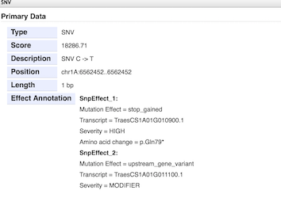
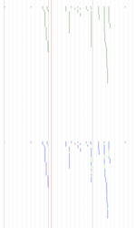
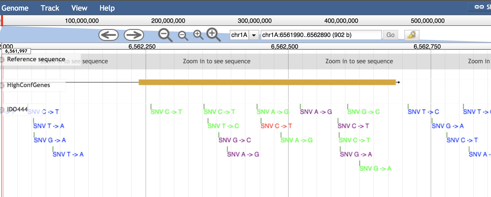

# Variant Effect Plugin
Parses the ANN field from a VCF file that has been ran through Ensembl's [VEP tool](https://www.ensembl.org/vep) or another tool [SNPEff](http://snpeff.sourceforge.net/). This plugin will format the ANN field to a human readable field in the Primary Data popup info window and will color code Variants based on mutation type. 
* Green - Synonymous
* Purple - NonSynonymous
* Red - Truncation/Stop gained
* Blue - Intron/other

## Install

For JBrowse 1.11.6+ in the _JBrowse/plugins_ folder, type:  
``git clone https://github.com/hans-vg/jbplugin-varianteffect.git VariantEffectPlugin``

## Activate
Add this to _jbrowse.conf_ under `[GENERAL]`:

    [ plugins.VariantEffectPlugin ]
    location = plugins/VariantEffectPlugin

Then, in your track configuration, use the following example block:

    [ tracks.MyTrack ]
    storeClass     = JBrowse/Store/SeqFeature/VCFTabix
    type = VariantEffectPlugin/View/Track/CanvasEffectVariants
    urlTemplate    = vcf_files/mysample.vcf.gz
    tbiUrlTemplate = vcf_files/mysample.vcf.gz.tbi
    maxHeight = 1000
    category = Varietal SNPs 
    key  = MyTrackName

                
## Usage

  
  
  

Each variant in the loaded VCF file that has the 'ANN' field in the last column will be parsed to display the Variant Effect information in human-readable format in the Info Window box when a variant is clicked 
in the Browser view. It also changes the default coloring of the Zoomed Out view to be color coded, as well as when you zoom in.
